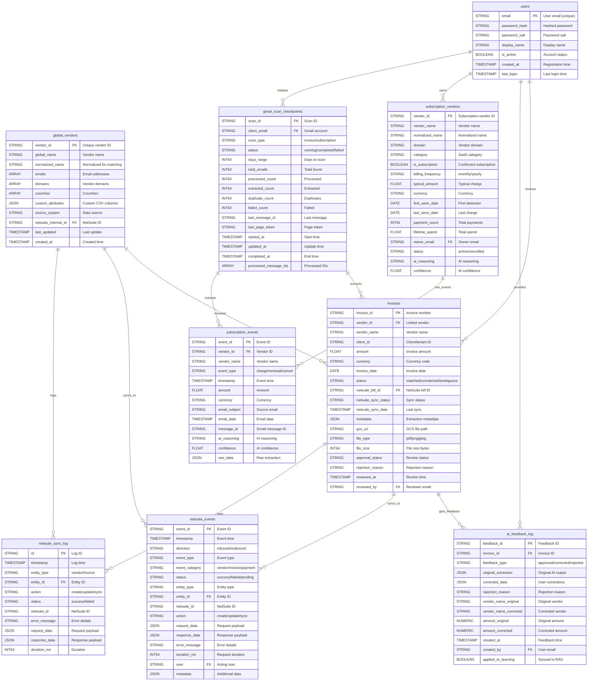

# Invoice AI - Complete API Documentation

## Overview
This document contains all public API endpoints and database entities for the Invoice AI Enterprise Platform.

---

# ENTITY RELATIONSHIP DIAGRAM (ERD)

## ERD Relationship Summary

| Relationship | Description |
|--------------|-------------|
| `users` → `invoices` | Users review and approve invoices |
| `users` → `ai_feedback_log` | Users provide feedback on AI extractions |
| `users` → `subscription_vendors` | Users own/manage subscriptions |
| `users` → `gmail_scan_checkpoints` | Users initiate Gmail scans |
| `global_vendors` → `invoices` | Vendors receive invoices |
| `global_vendors` → `netsuite_*` | Vendors sync to NetSuite |
| `invoices` → `ai_feedback_log` | Invoices receive feedback for learning |
| `invoices` → `netsuite_*` | Invoices sync to NetSuite as bills |
| `subscription_vendors` → `subscription_events` | Subscriptions have charge events |
| `gmail_scan_checkpoints` → `invoices` | Email scans extract invoices |
| `gmail_scan_checkpoints` → `subscription_events` | Email scans extract subscription events |

---

# API ENDPOINTS

## Authentication & Pages

| Method | Endpoint | Description | Auth Required |
|--------|----------|-------------|---------------|
| GET/POST | `/login` | User login page | No |
| GET/POST | `/register` | User registration page | No |
| GET | `/logout` | Logout current user | Yes |
| GET | `/` | Main dashboard | Yes |
| GET | `/budget` | AI Budget Intelligence dashboard | Yes |
| GET | `/netsuite-dashboard` | NetSuite sync dashboard | Yes |
| GET | `/health` | Health check endpoint | No |
| GET | `/api` | API info endpoint | No |

---

## Invoice Management

| Method | Endpoint | Description |
|--------|----------|-------------|
| POST | `/upload` | Upload invoice file (PDF/PNG/JPEG) for AI extraction |
| POST | `/process` | Process invoice with Document AI + Gemini |
| GET | `/api/invoices/list` | List all invoices with pagination |
| GET | `/api/invoices/matches` | Alias for `/api/invoices/list` |
| GET | `/api/invoices/<invoice_id>` | Get single invoice details |
| GET | `/api/invoices/<invoice_id>/download` | Download original invoice file |
| GET | `/api/invoices/gcs/signed-url` | Get signed URL for invoice download |
| GET | `/api/invoices/review` | Get invoices pending review |
| POST | `/api/invoices/<invoice_id>/approve` | Approve invoice extraction |
| POST | `/api/invoices/<invoice_id>/reject` | Reject invoice with reason |
| POST | `/api/invoices/<invoice_id>/update-vendor` | Update vendor info on invoice |
| POST | `/api/invoices/<invoice_id>/link-vendor` | Link invoice to vendor ID |
| GET | `/api/invoice/<invoice_id>/timeline` | Get invoice lifecycle timeline |

---

## Vendor Management

| Method | Endpoint | Description |
|--------|----------|-------------|
| GET | `/api/vendors/list` | List vendors with pagination & search |
| GET | `/api/vendors/search` | Search vendors by query |
| POST | `/api/vendors/add` | Add new vendor manually |
| POST | `/api/vendors/search-similar` | Find similar vendors (deduplication) |
| POST | `/api/vendors/create-from-invoice` | Create vendor from invoice data |
| POST | `/api/vendor/match` | AI semantic vendor matching |

### CSV Import

| Method | Endpoint | Description |
|--------|----------|-------------|
| POST | `/api/vendors/csv/analyze` | AI-powered CSV column mapping analysis |
| POST | `/api/vendors/csv/import` | Import vendors from mapped CSV |
| POST | `/api/vendors/csv/sync-netsuite` | Sync imported vendors to NetSuite |

---

## AI Budget Intelligence

| Method | Endpoint | Description |
|--------|----------|-------------|
| GET | `/api/budget/burn-rate` | Get current month burn rate & forecast |
| GET | `/api/budget/zombies` | Detect zombie/inactive subscriptions |
| GET | `/api/budget/anomalies` | Get spending anomalies & violations |
| GET | `/api/budget/summary` | Comprehensive budget intelligence summary |
| POST | `/api/budget/initialize-models` | Initialize BigQuery ML forecast models |
| POST | `/api/budget/zombie/mark-active` | Mark zombie subscription as active |
| POST | `/api/budget/zombie/confirm-cancelled` | Confirm subscription cancellation |

---

## Gmail Integration

| Method | Endpoint | Description |
|--------|----------|-------------|
| GET | `/api/ap-automation/gmail/auth` | Initiate Gmail OAuth flow |
| GET | `/api/ap-automation/gmail/callback` | OAuth callback handler |
| GET | `/api/ap-automation/gmail/status` | Check Gmail connection status |
| POST | `/api/ap-automation/gmail/disconnect` | Disconnect Gmail account |
| GET | `/api/ap-automation/gmail/import/stream` | SSE stream for invoice import |
| POST | `/api/ap-automation/gmail/import` | Start Gmail invoice import |
| GET | `/api/ap-automation/gmail/scans/resumable` | Get resumable scan jobs |
| POST | `/api/ap-automation/gmail/scans/<scan_id>/pause` | Pause active scan |

---

## Subscription Pulse (SaaS Tracking)

| Method | Endpoint | Description |
|--------|----------|-------------|
| GET | `/api/subscriptions/health-check` | Check subscription service health |
| POST | `/api/subscriptions/scan/start` | Start subscription email scan |
| GET | `/api/subscriptions/scan/status/<job_id>` | Get scan job status |
| GET | `/api/subscriptions/scan/active` | Check for active scans |
| GET | `/api/subscriptions/scan/stream` | SSE stream for scan progress |
| GET | `/api/subscriptions/cached` | Get cached subscription data |
| POST | `/api/subscriptions/<subscription_id>/claim` | Claim/assign subscription |
| GET | `/api/subscriptions/analytics` | Get subscription analytics |

---

## NetSuite Integration

### Status & Sync

| Method | Endpoint | Description |
|--------|----------|-------------|
| GET | `/api/netsuite/status` | Check NetSuite connection status |
| GET | `/api/netsuite/sync/dashboard` | Get sync dashboard data |
| POST | `/api/netsuite/sync/bulk` | Bulk sync entities |
| POST | `/api/netsuite/sync/payments` | Sync payment data |
| POST | `/api/netsuite/sync/audit` | Run sync audit |

### Vendors

| Method | Endpoint | Description |
|--------|----------|-------------|
| POST | `/api/netsuite/vendor/check` | Check if vendor exists in NetSuite |
| POST | `/api/netsuite/vendor/create` | Create vendor in NetSuite |
| POST | `/api/netsuite/vendor/update` | Update vendor in NetSuite |
| GET | `/api/netsuite/vendors/all` | Get all NetSuite vendors |
| POST | `/api/netsuite/vendors/bulk/<action>` | Bulk vendor actions |
| POST | `/api/netsuite/sync/vendors/bulk` | Bulk sync vendors |
| POST | `/api/repair/vendor/<vendor_id>/netsuite/<netsuite_id>` | Repair vendor link |

### Invoices/Bills

| Method | Endpoint | Description |
|--------|----------|-------------|
| POST | `/api/netsuite/invoice/<invoice_id>/create` | Create bill in NetSuite |
| POST | `/api/netsuite/invoice/<invoice_id>/update` | Update bill in NetSuite |
| POST | `/api/netsuite/invoice/<invoice_id>/update-bill` | Alias for update |
| GET | `/api/netsuite/invoices/all` | Get all NetSuite invoices |
| POST | `/api/netsuite/invoices/bulk/<action>` | Bulk invoice actions |
| POST | `/api/netsuite/sync/invoices/bulk` | Bulk sync invoices |
| POST | `/api/netsuite/sync/invoice/<invoice_id>` | Sync single invoice |
| GET | `/api/netsuite/invoice/<invoice_id>/truth` | Get invoice truth from NetSuite |

### Bills & Payments

| Method | Endpoint | Description |
|--------|----------|-------------|
| GET | `/api/netsuite/bill/<invoice_id>/approval` | Get bill approval status |
| GET | `/api/netsuite/bill/<external_id>/status` | Get bill status by external ID |
| GET | `/api/netsuite/bills/audit` | Audit bills dashboard |
| GET | `/api/netsuite/bills/audit-trail` | Get bill audit trail |
| POST | `/api/netsuite/bills/sync-approvals` | Sync bill approval statuses |
| POST | `/api/netsuite/payments/sync` | Sync payments from NetSuite |
| POST | `/api/netsuite/payments/sweep` | Sweep for new payments |
| GET | `/api/netsuite/payments/status/<invoice_id>` | Get payment status |
| GET | `/api/netsuite/payments/statistics` | Get payment statistics |

### Events & Activities

| Method | Endpoint | Description |
|--------|----------|-------------|
| GET | `/api/netsuite/events/dashboard` | Events dashboard page |
| GET | `/api/netsuite/events` | Get NetSuite events list |
| GET | `/api/netsuite/events/stats` | Get event statistics |
| GET | `/api/netsuite/events/supported` | Get supported event types |
| POST | `/api/netsuite/events/log` | Log custom event |
| POST | `/api/netsuite/events/cleanup-fake` | Clean up test events |
| GET | `/api/netsuite/activities` | Get activity feed |
| GET | `/api/netsuite/statistics` | Get overall statistics |

---

## AI Agent (LangGraph)

| Method | Endpoint | Description |
|--------|----------|-------------|
| POST | `/api/agent/chat` | Send message to AI agent |
| POST | `/api/agent/chat/stream` | Streaming chat response |
| GET | `/api/agent/status` | Get agent status |
| POST | `/api/agent/generate-key` | Generate API key |
| POST | `/api/agent/search` | Agent-powered search |
| GET | `/api/agent/vendor/<vendor_id>` | Get vendor via agent |
| GET | `/api/agent/invoice/<invoice_id>` | Get invoice via agent |
| GET | `/api/agent/client/<client_id>/summary` | Get client summary |
| GET | `/api/agent/issues` | Get open issues |
| POST | `/api/agent/issues/<issue_id>/resolve` | Resolve issue |
| POST | `/api/agent/vendor/send-email` | Send email to vendor |
| POST | `/api/agent/client/notify` | Notify client |
| POST | `/api/agent/actions/create` | Create pending action |
| GET | `/api/agent/actions/pending` | Get pending actions |
| POST | `/api/agent/actions/<action_id>/approve` | Approve action |

---

## AI Feedback & Learning

| Method | Endpoint | Description |
|--------|----------|-------------|
| GET | `/api/ai/feedback/patterns` | Get AI learning patterns |

---

# DATABASE ENTITIES (BigQuery Tables)

All tables are in the `vendors_ai` dataset.

## 1. `users` - User Authentication

| Column | Type | Mode | Description |
|--------|------|------|-------------|
| email | STRING | REQUIRED | User email (unique identifier) |
| password_hash | STRING | REQUIRED | SHA-256 hashed password |
| password_salt | STRING | REQUIRED | Password salt |
| display_name | STRING | NULLABLE | User display name |
| is_active | BOOLEAN | REQUIRED | Account active status |
| created_at | TIMESTAMP | REQUIRED | Registration timestamp |
| last_login | TIMESTAMP | NULLABLE | Last login timestamp |

---

## 2. `global_vendors` - Vendor Master Data

| Column | Type | Mode | Description |
|--------|------|------|-------------|
| vendor_id | STRING | REQUIRED | Unique vendor identifier |
| global_name | STRING | REQUIRED | Vendor display name |
| normalized_name | STRING | NULLABLE | Normalized name for matching |
| emails | STRING | REPEATED | Vendor email addresses |
| domains | STRING | REPEATED | Vendor domains |
| countries | STRING | REPEATED | Countries of operation |
| custom_attributes | JSON | NULLABLE | Custom CSV columns |
| source_system | STRING | NULLABLE | Data source (csv, invoice, manual) |
| netsuite_internal_id | STRING | NULLABLE | NetSuite vendor ID |
| last_updated | TIMESTAMP | NULLABLE | Last modification time |
| created_at | TIMESTAMP | NULLABLE | Creation timestamp |

---

## 3. `invoices` - Invoice Data

| Column | Type | Mode | Description |
|--------|------|------|-------------|
| invoice_id | STRING | REQUIRED | Invoice number/ID |
| vendor_id | STRING | NULLABLE | Linked vendor ID |
| vendor_name | STRING | NULLABLE | Vendor name from extraction |
| client_id | STRING | NULLABLE | Client/tenant identifier |
| amount | FLOAT64 | NULLABLE | Invoice amount |
| currency | STRING | NULLABLE | Currency code (USD, EUR, etc.) |
| invoice_date | DATE | NULLABLE | Invoice date |
| status | STRING | NULLABLE | matched/unmatched/ambiguous |
| netsuite_bill_id | STRING | NULLABLE | NetSuite bill internal ID |
| netsuite_sync_status | STRING | NULLABLE | synced/pending/failed |
| netsuite_sync_date | TIMESTAMP | NULLABLE | Last NetSuite sync time |
| metadata | JSON | NULLABLE | Full extraction metadata |
| gcs_uri | STRING | NULLABLE | Google Cloud Storage URI |
| file_type | STRING | NULLABLE | pdf/png/jpeg |
| file_size | INT64 | NULLABLE | File size in bytes |
| approval_status | STRING | NULLABLE | approved/rejected/pending |
| rejection_reason | STRING | NULLABLE | Reason for rejection |
| reviewed_at | TIMESTAMP | NULLABLE | Review timestamp |
| reviewed_by | STRING | NULLABLE | Reviewer email |
| created_at | TIMESTAMP | NULLABLE | Creation timestamp |
| last_updated | TIMESTAMP | NULLABLE | Last update timestamp |

---

## 4. `subscription_vendors` - SaaS Subscription Tracking

| Column | Type | Mode | Description |
|--------|------|------|-------------|
| vendor_id | STRING | REQUIRED | Unique vendor identifier |
| vendor_name | STRING | REQUIRED | Subscription vendor name |
| normalized_name | STRING | NULLABLE | Normalized for matching |
| domain | STRING | NULLABLE | Vendor domain |
| category | STRING | NULLABLE | SaaS category |
| is_subscription | BOOLEAN | NULLABLE | Confirmed subscription |
| billing_frequency | STRING | NULLABLE | monthly/yearly/quarterly |
| typical_amount | FLOAT64 | NULLABLE | Typical charge amount |
| currency | STRING | NULLABLE | Currency code |
| first_seen_date | DATE | NULLABLE | First detection date |
| last_seen_date | DATE | NULLABLE | Last charge date |
| payment_count | INT64 | NULLABLE | Total payment count |
| lifetime_spend | FLOAT64 | NULLABLE | Total lifetime spend |
| owner_email | STRING | NULLABLE | Subscription owner |
| status | STRING | NULLABLE | active/cancelled/paused |
| ai_reasoning | STRING | NULLABLE | AI classification reasoning |
| confidence | FLOAT64 | NULLABLE | AI confidence score |
| created_at | TIMESTAMP | NULLABLE | Creation timestamp |
| updated_at | TIMESTAMP | NULLABLE | Last update timestamp |

---

## 5. `subscription_events` - Subscription Activity

| Column | Type | Mode | Description |
|--------|------|------|-------------|
| event_id | STRING | REQUIRED | Unique event identifier |
| vendor_id | STRING | REQUIRED | Related vendor ID |
| vendor_name | STRING | NULLABLE | Vendor name |
| event_type | STRING | REQUIRED | charge/renewal/cancel/trial |
| timestamp | TIMESTAMP | REQUIRED | Event timestamp |
| amount | FLOAT64 | NULLABLE | Transaction amount |
| currency | STRING | NULLABLE | Currency code |
| email_subject | STRING | NULLABLE | Source email subject |
| email_date | TIMESTAMP | NULLABLE | Source email date |
| message_id | STRING | NULLABLE | Gmail message ID |
| ai_reasoning | STRING | NULLABLE | AI extraction reasoning |
| confidence | FLOAT64 | NULLABLE | AI confidence score |
| raw_data | JSON | NULLABLE | Raw extraction data |
| created_at | TIMESTAMP | NULLABLE | Creation timestamp |

---

## 6. `netsuite_events` - NetSuite Event Tracking

| Column | Type | Mode | Description |
|--------|------|------|-------------|
| event_id | STRING | REQUIRED | Unique event identifier |
| timestamp | TIMESTAMP | REQUIRED | Event timestamp |
| direction | STRING | REQUIRED | inbound/outbound |
| event_type | STRING | REQUIRED | Type of event |
| event_category | STRING | REQUIRED | vendor/invoice/payment |
| status | STRING | REQUIRED | success/failed/pending |
| entity_type | STRING | NULLABLE | vendor/invoice |
| entity_id | STRING | NULLABLE | Entity identifier |
| netsuite_id | STRING | NULLABLE | NetSuite internal ID |
| action | STRING | NULLABLE | create/update/sync |
| request_data | JSON | NULLABLE | API request payload |
| response_data | JSON | NULLABLE | API response payload |
| error_message | STRING | NULLABLE | Error details |
| duration_ms | INT64 | NULLABLE | Request duration |
| user | STRING | NULLABLE | Acting user |
| metadata | JSON | NULLABLE | Additional metadata |

---

## 7. `netsuite_sync_log` - Sync Activity Log

| Column | Type | Mode | Description |
|--------|------|------|-------------|
| id | STRING | REQUIRED | Log entry identifier |
| timestamp | TIMESTAMP | REQUIRED | Log timestamp |
| entity_type | STRING | NULLABLE | vendor/invoice |
| entity_id | STRING | NULLABLE | Entity identifier |
| action | STRING | NULLABLE | create/update/sync |
| status | STRING | NULLABLE | success/failed/pending |
| netsuite_id | STRING | NULLABLE | NetSuite internal ID |
| error_message | STRING | NULLABLE | Error details |
| request_data | JSON | NULLABLE | Request payload |
| response_data | JSON | NULLABLE | Response payload |
| duration_ms | INT64 | NULLABLE | Request duration |

---

## 8. `gmail_scan_checkpoints` - Email Scan Progress

| Column | Type | Mode | Description |
|--------|------|------|-------------|
| scan_id | STRING | REQUIRED | Unique scan identifier |
| client_email | STRING | REQUIRED | Gmail account email |
| scan_type | STRING | REQUIRED | invoice/subscription |
| status | STRING | REQUIRED | running/completed/failed |
| days_range | INT64 | REQUIRED | Days to scan |
| total_emails | INT64 | REQUIRED | Total emails found |
| processed_count | INT64 | REQUIRED | Emails processed |
| extracted_count | INT64 | REQUIRED | Invoices extracted |
| duplicate_count | INT64 | REQUIRED | Duplicates skipped |
| failed_count | INT64 | REQUIRED | Failed extractions |
| last_message_id | STRING | NULLABLE | Last processed message |
| last_page_token | STRING | NULLABLE | Gmail pagination token |
| started_at | TIMESTAMP | REQUIRED | Scan start time |
| updated_at | TIMESTAMP | REQUIRED | Last update time |
| completed_at | TIMESTAMP | NULLABLE | Completion time |
| error_message | STRING | NULLABLE | Error details |
| processed_message_ids | ARRAY<STRING> | NULLABLE | Processed message IDs |

---

## 9. `ai_feedback_log` - AI Learning Feedback

| Column | Type | Mode | Description |
|--------|------|------|-------------|
| feedback_id | STRING | REQUIRED | Unique feedback identifier |
| invoice_id | STRING | REQUIRED | Related invoice ID |
| feedback_type | STRING | REQUIRED | approved/corrected/rejected |
| original_extraction | JSON | NULLABLE | Original AI extraction |
| corrected_data | JSON | NULLABLE | User-corrected data |
| rejection_reason | STRING | NULLABLE | Rejection reason |
| vendor_name_original | STRING | NULLABLE | Original vendor name |
| vendor_name_corrected | STRING | NULLABLE | Corrected vendor name |
| amount_original | NUMERIC | NULLABLE | Original amount |
| amount_corrected | NUMERIC | NULLABLE | Corrected amount |
| created_at | TIMESTAMP | REQUIRED | Feedback timestamp |
| created_by | STRING | REQUIRED | User who provided feedback |
| applied_to_learning | BOOLEAN | REQUIRED | Synced to Vertex AI |

---

# EXTERNAL INTEGRATIONS

## Google Cloud Services
- **Document AI**: Invoice layout extraction
- **Vertex AI Search**: RAG knowledge base for context
- **Gemini 1.5/2.5/3 Pro**: Semantic AI processing
- **BigQuery**: Data storage and ML models
- **Cloud Storage (GCS)**: Invoice file storage

## NetSuite
- **OAuth 1.0a**: Authentication
- **REST API**: Vendor and bill management
- **Supported Record Types**: Vendor, VendorBill

## Gmail
- **OAuth 2.0**: User authorization
- **Gmail API**: Email scanning and attachment extraction

---

*Generated for Invoice AI Enterprise Platform*
